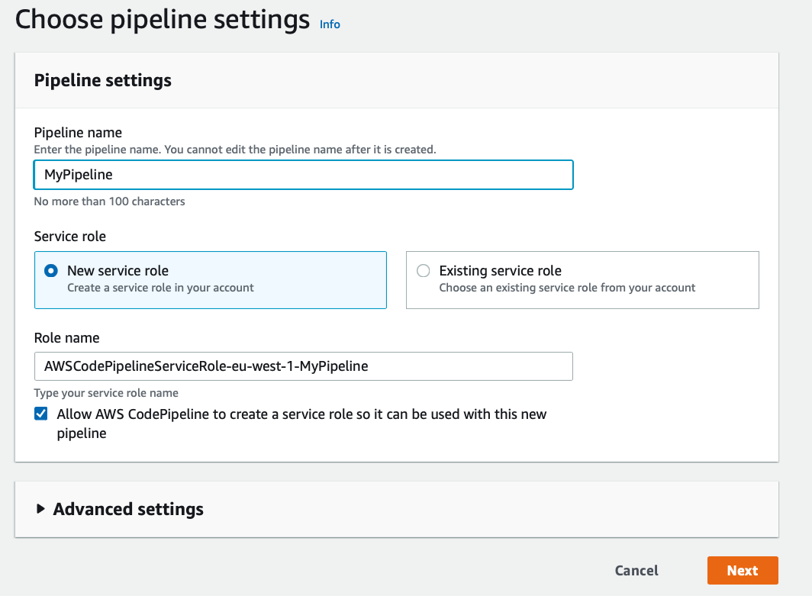
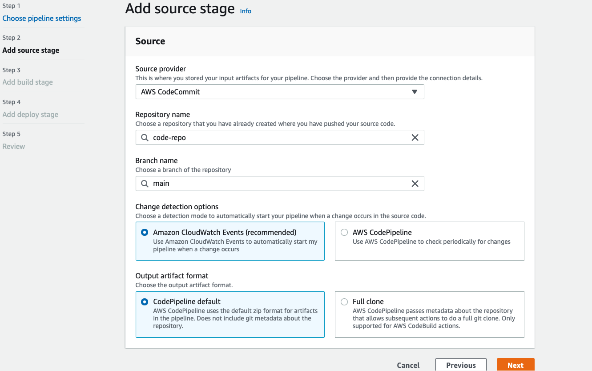
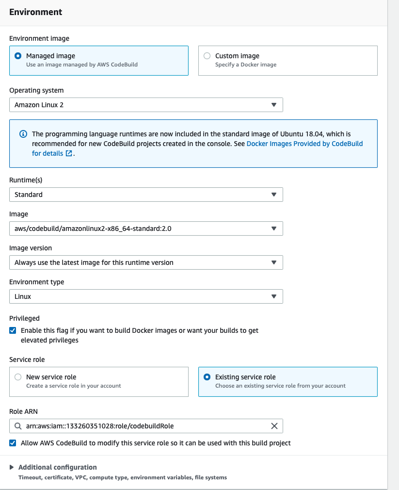
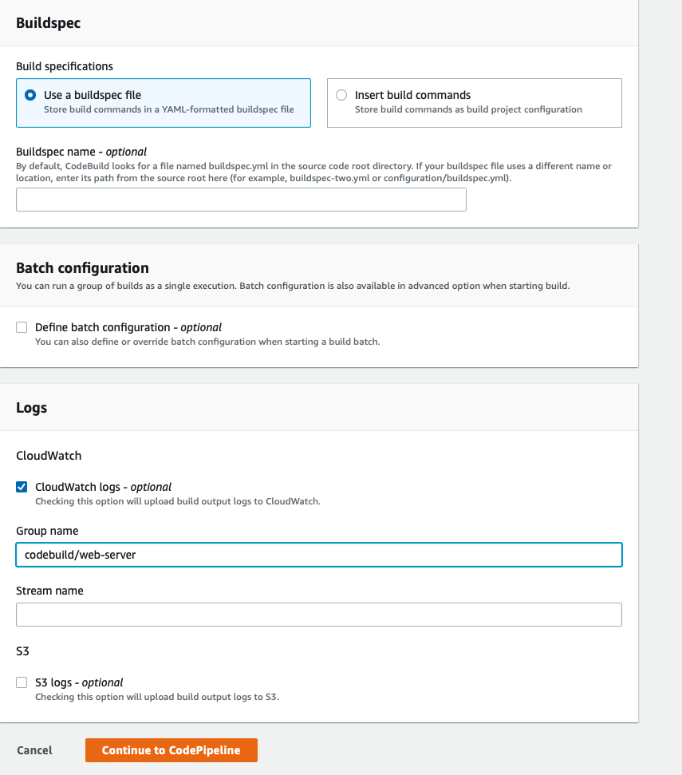
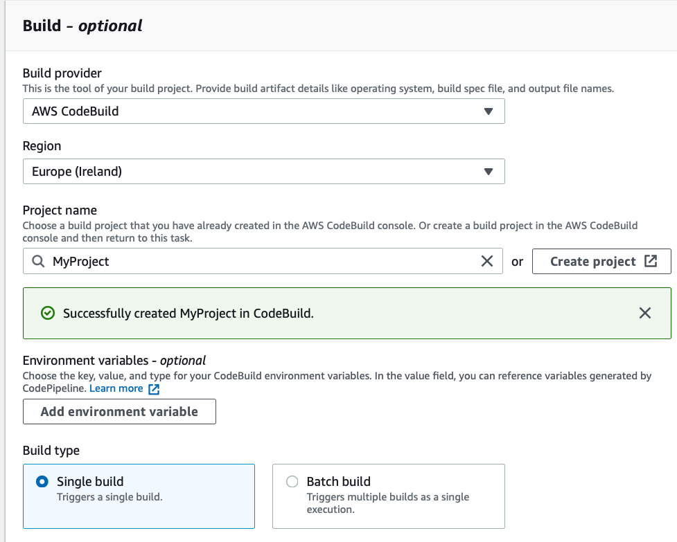
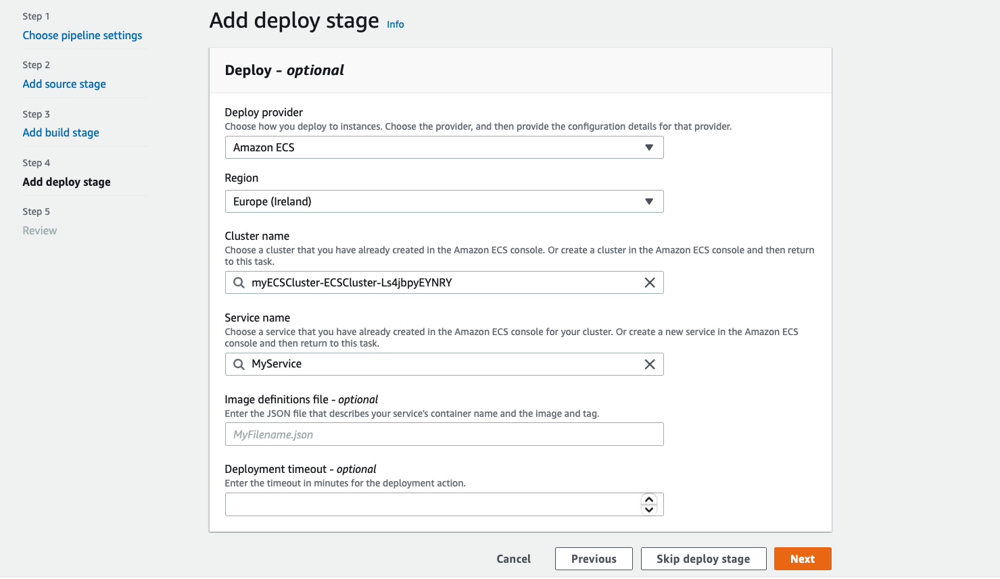

# Create a CI/CD Pipeline in ECS

The template in this repository can be used a base to create your own CI/CD pipeline that can track changes to your code, rebuild your Docker image and deploy them on ECS

Requirements:
- AWS Account with permissions to launch the resources
- AWS CLI Version 2 is configured
- an EC2 instance with the `ECS-Optimized AMI` (will save steps to install docker, etc.)
- install the **jq** JSON processor `https://stedolan.github.io/jq/`
- clone this repository

Services we will use:
- Amazon ECS (Fargate)
- Amazon ECR
- Elastic Load Balancer
- AWS CodeBuild
- AWS CodeCommit
- AWS CodePipeline
- AWS CloudFormation
- AWS CloudWatch
- IAM


## Steps to create the CI/CD Pipeline

### Preparing the environment

We will be building ontop of resources created by the CloudFormation stacks `NetworkStack` and the `ECS Cluster Stack`.

### clone this repository and execute the setup.sh script

```
git clone xxxx
cd aws-templates-ecs/cicd-pipeline/code/
chmod +x setup.sh
sh setup.sh
```

***Actions performed by the `setup.sh` script***

- setup environment variables
    - query resources created by CloudFormation stacks so they can be reused
- create CloudWatch LogGroups for CodeCommit and ECS
- create ECR and CodeCommit repositories
- create Target Group and listening rule for the ALB
- create the `cicdtaskdef` Task Definition and `MyService` ECS Service 
    - note: at this point ECS Service will be created but Tasks will fail as image is not yet in ECR. This will change after your first `git push`
- delete the .git file to prevent issues when using Git client
- `outputs.txt` file will be created with the resources and variable values used

#### create a CodePipeline 

1. Go to the AWS CodePipeline console https://console.aws.amazon.com/codepipeline/

    - Enter a name for your pipeline
    - select "new service role"
        - Role name should be autopopulated with name of pipeline
    - click, "Allow AWS CodePipeline to create a service role so it can be used with this new pipeline"
    - click **Next**

    

2. Add source stage

    - source provider, choose AWS CodeCommit
    - Repository name, choose 'code-repo' (created by our `setup.sh` script)
    - Branch name, type 'main'
    - Chage detection options, choose 'Amazon CloudWatch Events'
    - Output artifact format, choose 'CodePipeline default'
    - click **Next**

    

3. Add build stage

    - Build Provider, choose AWS CodeBuild
    - set your region
    - Project name, choose 'Create Project' (opens new window)

    Create build project

    - give a name to project
    - skip **Additional Configuration**
    - **Environment image** choose **Managed image**.**
    - **Operating system** choose **Amazon Linux 2**
    - **Runtime** choose **Standard**
    - **Image** choose **aws/codebuild/amazonlinux2-x86_64-standard:2.0**
    - choose **Image version** (latest) and **Environment type** (Linux)
    - select the option **Privilege**       
    - For **Service Role** choose **Existing service role**,`codebuildRole` (created by our `setup.sh` script)
    - Ensure the checkbox **Allow AWS CodeBuild to modify this service role so it can be used with this build project** is ticked.
    - Skip the **Additional Configuration**

    

    - For **Build specifications** accept the default **Use a buildspec file**, Leave the Buildspec name blank. 
        - By default, AWS CodeBuild will look for the `buildspec.yml` file in the source code root. (this is provided in the files you cloned)
    - Select the check-box **CloudWatch logs**
    - Specify the log group **/codebuild/web-server** (created by our `setup.sh` script)
    - Click **Continue to CodePipeline**

    

    Build Stage should now look like this:

    

    - click **Next**

4. Deploy stage

    - For **Deploy provider** choose **Amazon ECS**
    - set your region
    - For Cluster name choose the cluster created by the `ECS Cluster Stack`, (should be something like `myECSCluster-ECSCluster-xxxxxxxxx`)
    - For Service name choose `MyService` (created by our `setup.sh` script)
    - Leave the remaining fields blank.
    - click **Next**

    

5. Review and create pipeline    

#### Go back to your Terminal and use credentials helper for CodeCommit and initialize local repo

```
git config --global credential.helper '!aws codecommit credential-helper $@'
git config --global credential.UseHttpPath true

git init
git switch -c main
git remote add origin $CODE_COMMIT_REPO
```

#### to view current status 

`git status`

#### initial commit and push the files in this directory to CodeCommit

```
git add -A
git commit -m "my first commit"
git push --set-upstream origin main
git status
```

#### the initial commit should have executed the pipeline deployed. open the codepipeline console and see if it executed correctly

If it has, you can do `echo $ALB_URL` to get the URL address of your Load Balancer. Copy the ALB URL and paste it in your browser, you should very simple page open.

### Now any changes you make to the code, will be tracked by Git and any additional push will execute the pipeline again.

### test the pipeline

make a change to the `index.html` file

change the title:

    For example, you can change the text inside the `<h1>` and `<\h1>` tags
    
    `<h1>My sample app</h1>`  to  `<h1>My first change </h1>`

# see changes tracked by git

`git status`

# after you have made all changes, you can commit and push to CodeCommit

```
git add -A
git commit -m "updated the index.html file"
git push
```

As you can see, this will trigger a new execution of the pipeline and a few moments after it has completed you should see the changes when you refresh the webpage on your browser.

## so what happened once you did the `git push`?

- code is updated to CodeCommit
- the code will be rebuild in CodeBuild 
    - in this case the Docker image will be rebuild with the changes made
    - the new Docker image will be pushed to ECR repository
    - the Task Definition of the service `MyService` will be updated with the new image
- a new deployment will be done
    - ECS will invoke an `UpdateService` API with the latest revision of the Task Definition
    - ECS will launch the Tasks with new image
    - once new Tasks reach a `RUNNING` state, the old Tasks will be `STOPPED`
